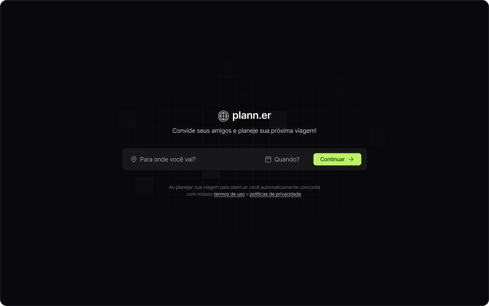

<div align="center">
    <h1 align="center">plann.er$</h1>
    <p>plann.er é um aplicação para montar planos de viagem com amigos, registrar atividades e links úteis. Utilizando tecnologias como React, Vite e TypeScript, sendo um client web.</p>
    
</div>

# 📒 Índice
* [Descrição](#descrição)
* [Requisitos Funcionais](#requisitos)
  * [Features](#features)
* [Tecnologias](#tecnologias)
* [Design](#design)
  * [Cores](#cores)
  * [Fontes](#fontes)
  * [Ícones](#ícones)
* [Instalação](#instalação)
* [Licença](#licença)

# 📃 <span id="descrição">Descrição</span>
Aplicação desenvolvida com fins de montar planos de viagem com amigos, registrar atividades e links úteis. Trabalhando com datas, conceitos de estado e imutabilidade, componentização e requisição a API externa.

# 📌 <span id="requisitos">Requisitos Funcionais</span>
- [x] Validação de local e data<br>
- [x] Cadastro de convidados via e-mail<br>
- [x] Cadastro do nome e-mail do organizador<br>
- [x] Cadastro de atividades com horário e data dentro das datas definidas e exibição<br>
- [x] Cadastro de links importantes e exibição<br>
- [x] Exibição de convidados identificando os confirmados e nao confirmados<br>

## Features
- [x] Requisição a API<br>
- [x] Responsividade<br>

# 💻 <span id="tecnologias">Tecnologias</span>
- **HTML**
- **CSS**
- **JavaScript**
- **TypeScript**
- **Vite**
- **ReactJS**
- **React Router DOM**
- **React DayPicker**
- **tailwind**
- **tailwind-variants**
- **date-fns**

# 🎨 <span id="design">Design</span>
- O modelo final para versão desktop e mobile está disponível na pasta `./design`

- <span id="cores">Cores<br></span>
  * #09090B<br>
  * #A3E635<br>
  * #A1A1A6<br>
  * #FAFAFA<br>

- <span id="fontes">Fontes<br></span>
  * Inter, sans-serif

- <span id="ícones">Ícones<br></span>
  * Lucide React

# 🚀 <span id="instalação">Instalação</span>
```bash
  # Clone este repositório:
  $ git clone https://github.com/CleilsonAndrade/plann.er.git
  $ cd ./plann.er

  # Instalar as dependências:
  $ yarn install

  # Executar:
  $ yarn dev
```

# 📝 <span id="licença">Licença</span>
Esse projeto está sob a licença MIT. Veja o arquivo [LICENSE](LICENSE) para mais detalhes.

---

<p align="center">
  Feito com 💜 by CleilsonAndrade
</p>